---
----
## PORTFOLIO I-Talent

Mees Barends
----
---

 
---
# Inhoudsopgave
----
1. Voorstelling
2. Overzicht activiteiten
    1. Verplichte activiteiten, per domein
             &emsp;&emsp;&emsp;&emsp;1. Seminaries
          &emsp;&emsp;&emsp;&emsp;2. Innovatie
          &emsp;&emsp;&emsp;&emsp;3. Persoonlijke ontwikkeling 
          &emsp;&emsp;&emsp;&emsp;4. Internationalisering
    2. Extra activiteiten, per domein
         &emsp;&emsp;&emsp;&emsp;1. Creatieve versie portfolio
          &emsp;&emsp;&emsp;&emsp;2. Seminaries
          &emsp;&emsp;&emsp;&emsp;3. Persoonlijke ontwikkeling 
          &emsp;&emsp;&emsp;&emsp;4. Student Engagement
3. Selectie van activiteiten
    1. Uitwisseling
         &emsp;&emsp;&emsp;&emsp;1. Uitwisseling reflectie
    2. Certificaat HoofdAnimator
         &emsp;&emsp;&emsp;&emsp;1. Certificaat hoofdanimator reflectie 
    3. Hackathon
         &emsp;&emsp;&emsp;&emsp;1. Hackathon reflectie 
4. Eindreflectie
----
---

---
# Voorstelling
----
Ik ben Mees Barendse een 22 jaar oude student toegepaste informatica aan de PXL met als afstudeer richting applicatieontwikkeling. Ik ben dus vooral geïnteresseerd in het ontwikkelen van applicaties maar ook in alles daarrond bijvoorbeeld dockerization, testing, en het onderliggende besturingssysteem maar alleen in zoverre me dat helpt met mijn applicaties beter te maken.

Mijn I-talent portfolio staat in het teken van soft skills. Een onderdeel van mijn professionele skills die ik aan het begin van de opleiding het minst belangrijk vond.

Over 3 tot 5 jaar hoop ik daar weer totaal van mening over te veranderen. Dat zou betekenen dat verdere ontwikkeling van mijn soft skills niet bijdraagt aan het worden van een betere ontwikkelaar.
----
---
---
# Overzicht activiteiten
----
Ik ben het eerste semester van modeljaar 3 op uitwisseling geweest waardoor ik niet alle verplichte minima voltooid heb. Johan Cleuren heeft dit normaal in orde gemaakt voor mij. In geval van problemen rond de niet beschreven verplichte minima wil ik dan ook alle potentiele vragen zijn kant op sturen.
----
---
---

## Verplichte activiteiten, per domein
---
---
### Seminaries
----
1. Toreon: Ethical hacking
    - Korte omschrijving activiteit: Korte presentatie over “Hacker mindset” & **“**integrity”. Gevolgd door het doen van challenges met de intentie ons allemaal “senior googler” te maken.
    - Locatie activiteit: PXL
    - Datum en duur: 19/03/2024 3u
----
----
2. Resillion: Code Katas
    - Korte omschrijving activiteit: Korte beschrijving wat een Code Kata is en wat de voordelen van code katas zijn. Gevolgd door het classicaal doen van fizzbuzz als een code kata.
    - Locatie activiteit: PXL 
    - Datum en duur: 26/03/2024 3u
----
----
3. Ordina: Clean code, TDD en Solid
    - Korte omschrijving activiteit: Presentatie waarbij de basisprincipes van clean code werden beschreven. Gevolgd door een korte beschrijving van TDD waarna SOLID werd uitgelegd.
    - Locatie activiteit: PXL
    - Datum en duur: 16/04/2024 3u
----
----
4. Politie: Digitaal onderzoek: forensics, cybercrime, crypto-assets en data-analyse
    - Korte omschrijving activiteit: Lezing over hoe een digitaal onderzoek in zijn werking gaat en hoe bewijs verzameld wordt. Gevolgd door een uitleg over Cyber Crime en digital forensics
    - Locatie activiteit: PXL
    - Datum en duur: 7/05/2024 3u
----
---
---
### Innovatie
----
1. Hackaton:
    - Interne hackathon in samenwerking met PXL Ergo/Healthcare
    - Korte omschrijving activiteit: In een team van 4 is een app ontwikkeld die verstandelijk gehandicapte door middel van spelletjes iets bij leert.
    - Locatie activiteit: PXL corda 7
    - Data en duur: 10/02/2025 – 11/02/2025 van 9u tot 17u
----
---
---

### Persoonlijke ontwikkeling
-----
----
1. Projectweek 2TIN:
    - Korte omschrijving activiteit: Week met verschillende sessies zoals onder anderen: ken jezelf, Netwerken werkt, LinkedIn en het job event
    - Locatie activiteit: PXL
    - Data en duur: 8-14 januari op schema van de PXL

----
----
2. POP-sessie 2TIN: 
    - Brein aan het werk! Niet storen!
	- Korte omschrijving activiteit: Het ging over hoe ons brein afgeleid wordt en hoe we beter kunnen focussen 
	- Locatie activiteit: PXL 
	- Data en duur: 5/03/2024 2u
----
----
3.	POP-sessie 2TIN: 
	- POPping
	- Korte omschrijving activiteit: Een sessie die ons help beter samen te werken, feedback te geven en ontvangen en hoe omgaan met stress.  
	- Locatie activiteit: PXL
	- Data en duur: 7/03/2024 2 uur 
----
-----
---
---
### Internationalisering
----
1. Uitwisseling
    - Korte omschrijving activiteit: Ik ben het eerste semester van dit jaar op uitwisseling geweest.
    - Locatie activiteit: Fachhochschule Oberösterreich,Softwarepark 11, 4232 Hagenberg im Mühlkreis, Oostenrijk
    - Data en duur: 23/09/2024 tot 01/02/2025 ca 4 maanden of ca 2880 uur
----
---
---
## Extra activiteiten, per domein
----
### Creatieve versie portfolio

[mijn creative verwerking](https://github.com/zwartemees/MDP)
----
---
---
### Seminaries
----
1. Digital Design Talk Bridging Human Experience and Technology
    - Korte omschrijving activiteit: Lezing over het onderzoek van de professor en hoe het ontwerp en functionaliteit van robots samen hangen
    - Locatie activiteit: FH3 FH OÖ Hagenberg im Mühlkreis
    - Datum en duur: 11/11/2024 2h
    - Bewijsstuk(ken)
-----
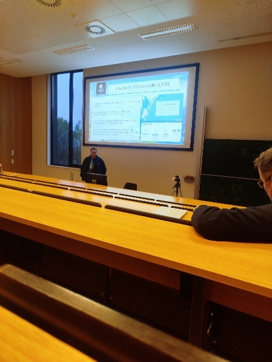
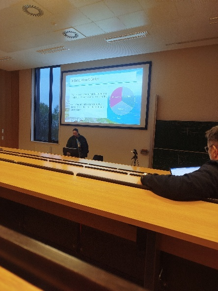
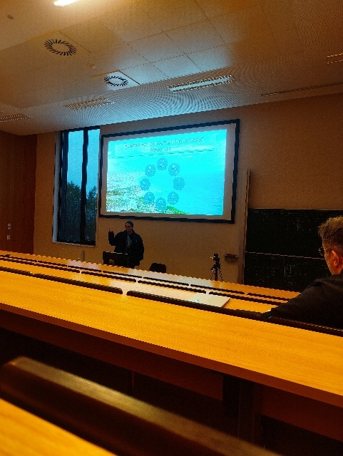
-----
----
---
---
### Persoonlijke ontwikkeling
----
1. Hoofdanimator attest behalen
   
    - Korte omschrijving activiteit:Het volgen van een cursus en volgen van een stage om hoofdanimator te worden in het jeugdwerk
    - Locatie activiteit: kamp van Beverlo in Leopoldsburg
    - Datum en duur: cursus: 30/10/2023 5/11/2023 & stage: 01/04/2024 – 7/04/2024 100h
    - Bewijsstuk(ken)
-----
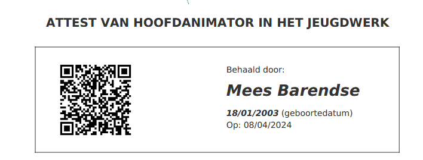
-----
----
---
---
### Student Engagement
----
2. International Fair
   
    - Korte omschrijving activiteit: Het delen van alle aanwezige culturen door iets typisch van je thuisland te koken. Voor België was dat: aardappelen met bloemkool en kaassaus
    - Locatie activiteit: FH3 FH OÖ Hagenberg im Mühlkreis
    - Datum en duur: 2/12/2024 4h
    - Bewijsstuk(ken)
-----
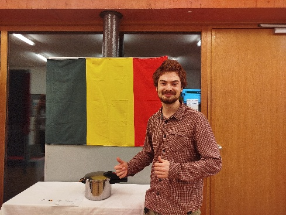
-----
----
---
---
# Selectie van activiteiten
---
---
## Uitwisseling
----
Ik ben één semester op uitwisseling geweest in Oostenrijk. Dat heb ik gedaan omdat het een groot avontuur is waarvan ik spijt zou hebben als ik er niet in mee ging. Ik had geen doelstellingen toen ik vertrok noch wist ik wat I-talent was.

Mijn wil om te vertrekken begon met een aankondiging tijdens de lessen communication skills uit 2Tin. Dat jaar kon ik niet gaan. Niet alleen omdat ik nog maar een week had om alles te regelen maar vooral omdat dit mijn tweede studie was waar ik het schooljaar ervoor na kerst mee gestart was.

Ik dacht er de rest van het jaar nog over na en besluit na een paar dagen al dat het makkelijker zou zijn om het te doen als ik me terug aangesloten heb bij het model traject. Het liefst zou ik ook geen vakken meer moeten doen die voortbouwen op kennis die ik niet gehad heb in het buitenland. Ik zet dus een melding in mijn agenda voor begin volgend schooljaar om me aan te melden nog een jaar later op uitwisseling te gaan. Na er nog een paar maanden langer over na te denken besluit ik dat ik graag op uitwisseling zou gaan.

It wordt gevolgd door bijna een jaar sporadisch papierwerk invullen en pas op de valreep mijn vakken door te kunnen geven. Hierna moest ik nog een wijziging maken aan mijn digital learning agreement. Iets wat me enige stress opleverde aangezien de PXL op dat moment gesloten was vanwege de zomervakantie. Uiteindelijk kom ik op 23/09/2024 na hulp van mijn buddy eindelijk aan in Oostenrijk. Een foto van mijn kamer op het moment van aankomst hieronder.
----
----
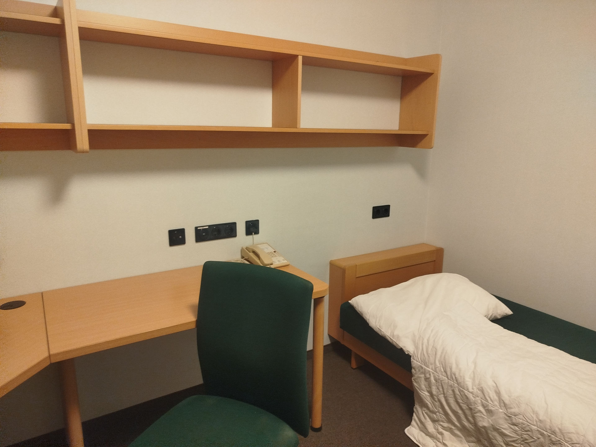

Figuur 3‑1: Mijn kamer op het moment dat ik aankwam
----
----
Het schooljaar in Oostenrijk begon met een Introductie week. Behalve alle internationale studenten waren de eerste jaar studenten daar ook . De foto hieronder is van alle internationale studenten met hun landsvlag op de eerste schooldag. De eerste week is besteed aan een rondleiding door de gebouwen, het bekend worden met hun digitale infrastructuur en het opstellen van ons rooster.
----
----

Figuur 3‑2: alle internationale studenten
----
----
Door de hoeveelheid tijd die alle internationale studenten samen spendeerde werden we al vrij snel goede vrienden. Voornamelijk in het weekend wanneer wij de enige in de studentenhuisvesting waren. We zijn ook op een aantal uitstappen geweest met de universiteit maar ook zonder. Hieronder een foto van ons op uitstap in Gmunden in weekend 2 van het schooljaar. Deze uitstap werd betaald door de universiteit.
----
----
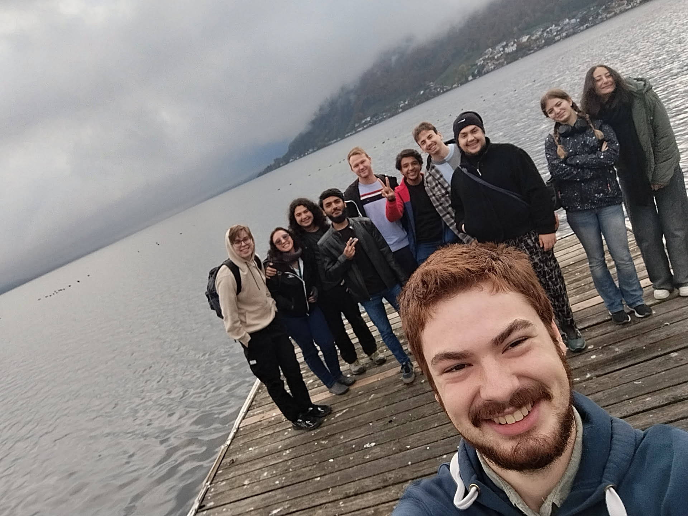
Figuur 3‑3: Wij als groep op uitstap in Gmunden
----
Zo ben ik ook nog met enkele andere op roadtrip geweest gedurende een verlengd weekend. Hieronder een foto van ik met 2 vrienden in Triëste nadat we door heel Slovenië geweest zijn.
----
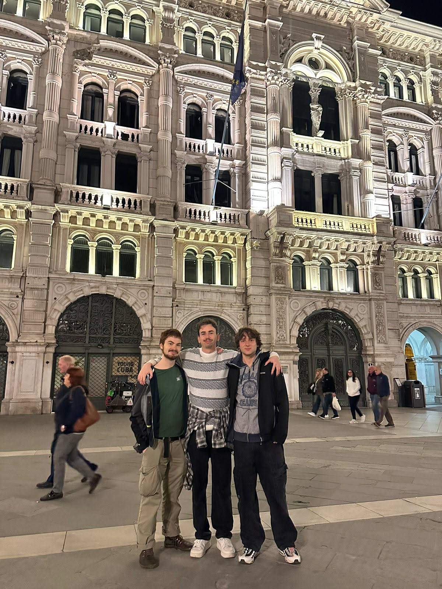
Figuur 3‑4: Ik en 2 vrienden in Triëst
----
----
Natuurlijk Heb ik daar ook les gevolgd. Ik had de vakken AI in Creativity, Algorithms and Data Structures, Creative Techniques and Presentation, German for Beginners, Introduction to Artificial Intelligence, Interaction Design and Prototyping, Mobile App Development en Semester project. Gelukkig was de les in het Engels en kon ik dus goed meevolgen. Alle vakken heb ik ook met succes afgerond met een gemiddeld punt van 1,6/5 wat ongeveer overeenkomt met 17/20. In tegenstelling tot aan de PXL zijn de leerkrachten daar maar deeltijds leerkracht. Dat maakt dat lessenrooster lastig te maken zijn en variëren week tot week. Het zorgde ook voor een chaotische start en eind van het semester. Want niet alle vakken eindigde of begonnen gelijktijdig. Waardoor Ik al een examen gemaakt had voor kerst terwijl ik voor andere vakken nog drie weken les had.
----
### Uitwisseling reflectie
----
Ondanks alle veranderingen was dit een geweldige ervaring die ik iedereen aanraad. Ik heb vrienden voor het leven gemaakt en veel geleerd over andere culturen en landen. Zoals bijvoorbeeld dat je in Pakistan geen rijbewijs moet hebben of dat het bijzonder is dat dorpswegen een verharding hebben.

Mijn hard skills zijn niet beter of slechter dan als ik in België gebleven was. Mijn soft skills daarentegen zijn erop vooruitgegaan. Zo heb ik bijvoorbeeld geleerd hoe je een gesprek voert zonder de ander in verlegenheid te brengen. In België hebben we nogal de nijging om te klagen over hoe ons belastinggeld wordt uitgegeven. In veel landen is alles wat ook maar een beetje met politiek te maken heeft taboe.

Deze ervaring heeft me ook bijgebracht dat naar het buitenland, in de EU, verhuizen geen grote stap is. Ik denk dat ik nu meer geneigd ben om dat te doen. Ik ben nu ook bewuster van hoe goed de meeste dingen in België geregeld zijn bijvoorbeeld de gezondheidszorg. Het proeven van eten uit andere culturen heeft me ook extra teleurgesteld in ons eten.

Het studeren aan een andere school heeft me ook laten nadenken over de mogelijkheid om verder te studeren. Iets wat ik daarvoor niet overwoog maar vanwege deze positieve ervaring lijkt een master halen steeds aantrekkelijker.

Het hebben van lectors die lesgeven in bijberoep terwijl ze zelf actief zijn in het werkveld was ook een interessante ervaring en ik heb het gevoel dat hun lessen me beter voorbereiden op het werkveld.
----
---
---
## Certificaat hoofdanimator
----
Ik heb het certificaat behaald om beter te worden in het communiceren met andere, het geven van feedback, het ontwikkelen van leiderschapsskills en het managen van evenementen.

Het halen van het certificaat bestaat uit twee delen een cursus van minstens 50 uur en een stage van minstens 50 uur. Mijn cursus was in Antwerpen waar we ons een week van de wereld afzonderde om een cursus van 280 pagina’s door te werken en op het einde een kamp uit te werken en te presenteren. 
----
----
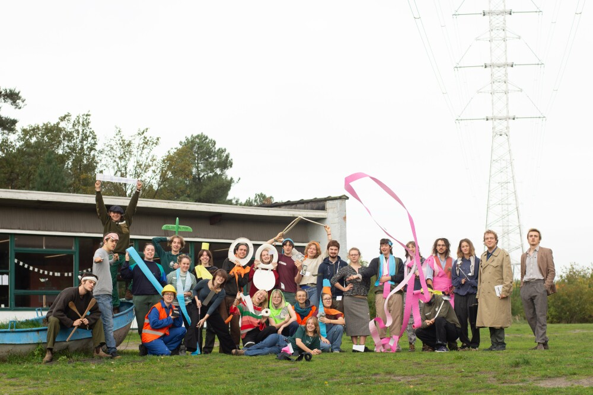
Figuur 3‑5: groepsfoto van deelnemers en instructeurs op cursus
----
----
De cursus werd onderverdeeld in sessies van tussen de 1 tot 2 uur steeds gegeven door een ander persoon. De sessies die direct interessant waren voor mijn beroepscompetenties zijn: Samenwerken, GDPR, Feedback, Persoonlijkheidsverschillen, presenteren, vergaderen theorie, vergaderen praktijk, organisatiecultuur en veranderingsprocessen. Andere sessies waarvan ik verwacht ooit gebruik te zullen maken in mijn loopbaan maar die in het komende jaar waarschijnlijk niet relevant gaan zijn, zijn: evenement organisatie, mentaal welzijn, stagebegeleiding, houding als voorzitter, inclusief handelen, Groepsvorming en dynamica, stagebegeleiding coaching 1 & 2, verzekeringen & noodplan en omgaan met integriteitsschendingen. Na de sessies werd er in een dag, in teams van 4, een evenement uitgewerkt. Het evenement waaraan ik heb meegewerkt heeft ook effectief plaatsgevonden.

Mijn stage bestond uit het organiseren van een jeugdkamp op het militair domein van Leopoldsburg. Een locatie die gekozen is omdat het houden van een kamp op het domein ons ook toestemming geeft om in het best bewaarde beekdallandschap van Europa, activiteiten te doen.

Helaas is het leger een bureaucratische nachtmerrie waardoor er verschillende problemen waren. Zo was het proces om de juiste vergunningen te krijgen ondoorzichtig waardoor het maande duurde. De communicatie was op veel momenten ook ondermaats waardoor documenten of processen regelmatig herhaald moesten worden.
----
----
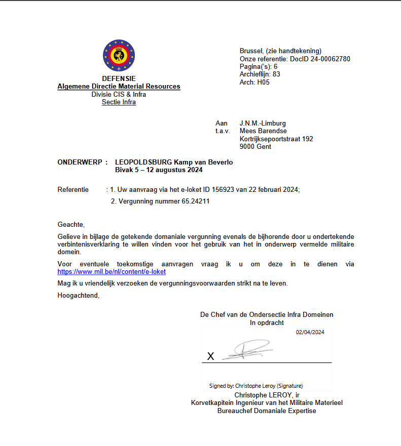
Figuur 3‑6: huurcontract dat mij werd opgestuurd per mail. De versie op papier is nog steeds niet aangekomen
----
----
Het materiaal ter plaatse krijgen werd gedaan door de stad Genk. Dat gebeurde door een miscommunicatie helaas een dag na het verstrijken van de vergunning, maar verliep verder zonder problemen.

Het kamp zelf verliep op een paar kleine incidenten probleemloos. Het begeleiden van een stagiair was een bijzondere ervaring. Tijdens de cursus werden ons tools aangereikt om het makkelijker te maken goede feedback te geven. Ons was ook verteld elke dag een gesprek te hebben met de stagiair om hem/haar een kans te geven zich snel aan te passen. Op het einde van het kamp moeten we een eindevaluatie geven en besluiten of de stagiair geslaagd is. Ik werd op dezelfde manier geëvalueerd door mijn stage mentor.

Mijn stagiair moet voor zijn stage als leiding aanwezig zijn op kamp en moet zelfstandig 1 activiteit organiseren. Ik word beoordeeld op mijn capaciteit mijn stagiair te begeleiden, het kamp in goede banen te leiden en het team van animators te leiden. Mijn stagiair is ook met vlag en wimpel geslaagd en deed een interessante activiteit over de voedselketen.

De feedback die mij gegeven werd was dat ik het team te vrij liet om hun moment van de dag in te vullen. Mijn organisatorische skills waren meer dan voldoende. Mijn stage werd met succes afgerond.
----
----
### Certificaat hoofdanimator reflectie
----
----
De doelen die ik wilde bereiken met het behalen van het certificaat waren: beter worden in communicatie met anderen, leren hoe ik op een goede manier feedback kan geven, mijn leiderschapsvaardigheden ontwikkelen en leren hoe ik een evenement kan managen. Na het afronden van zowel de cursus als de stage kan ik zeggen dat ik die doelen heb bereikt.

Vooral de cursus heeft me veel geleerd. De praktijkervaring tijdens de stage zorgde ervoor dat ik de theorie beter begreep en toepaste. Tijdens het kamp heb ik ook geleerd hoe ik moet omgaan met mensen die niet echt sterk zijn in plannen of organiseren, of mensen met een geheugen dat niet veel beter is dan dat van een goudvis. Dat was soms lastig, maar ook wel leerzaam.

Daarnaast was het begeleiden van een stagiair ook een nieuwe ervaring. Dat combineren met zelf stage lopen gaf me een ander perspectief op feedback. Ik heb gemerkt dat feedback geven en krijgen veel makkelijker gaat als het goed wordt gebracht en onderbouwd. Maar als dat niet gebeurt, wordt het ineens een stuk moeilijker en minder duidelijk.

Wat me ook opviel, is hoe snel een vergadering kan gaan als iedereen weet hoe je goed vergadert. Maar zodra er één persoon bij zit die dat niet kan, gaat het onmiddellijk moeilijker.

Wat ik niet had verwacht, was dat veel van de cursusinhoud terugkwam in een sessie van PXL tijdens de eerste week van semester twee. Het was interessant om te merken hoeveel ik herkende en hoeveel ik in die tijd eigenlijk al geleerd had.
----
---
---
## Hackathon
----
Op tien en elf februari 2025 heb ik deelgenomen aan de interne hackathon in samenwerking met PXL Ergo/Healthcare. Mij was van tevoren niet verteld wat de opdracht ging zijn. Dus mijn doelstelling was zo veel mogelijk security vulnerabilities te vinden en te leren hoe ze te vermijden.

In de ochtend van dag 1 werd ons verteld dat we verdeeld gingen worden in groepjes van vier en dat we niks moesten hacken maar dat we een applicatie gingen schrijven. In de afbeelding hieronder staat de opgave van de hackathon beschreven.
----
----
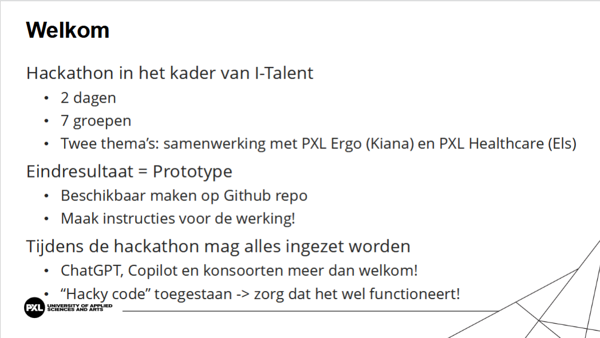
Figuur 3‑7: opgaven hackathon
----
----
De helft van de groepjes ontwikkelde een website die werknemers met een gezondheidsprobleem moest begeleiden in het indienen van alle benodigde documenten. De site moest ook Healthcare professionals helpen met het delen van informatie over patiënten. De tweede opdracht was het ontwikkelen van een Game voor mensen met een mentale handicap die een IQ tussen de 30 en 80 hebben. Er mocht geen afleiding in zitten en er moesten verschillende moeilijkheidsgraden zijn. Een laatste vereiste was dat de game zo gemakkelijk mogelijk gestart kunnen worden en te instaleren zijn op een andoid tablet. Vegen was ook te moeilijk voor sommige gebruikers.

Mijn groep kreeg de opdracht de game te ontwikkelen. Na een discussie welke technologie we zouden gaan gebruiken. Vond ons team dat we 3 opties hadden: Futter, PWA met vue.js of angular en Kotlin. We kozen niet voor Flutter want blijkbaar moet je in Flutter en ik quote “zeven lagen wrapers schrijven om een element op het scherm te krijgen.”. Een PWA was ook een optie maar niet iedereen was even bereid met Vue of Angular te werken. De laatste optie om de app in te ontwikkelen was Kotlin. Iets waar ik ervaring mee heb maar de rest van de groep niet. Uiteindelijk hebben we gekozen voor kotlin omdat UI in jetpack compose niet zo lastig te maken is en zodat we aan het eind van de hackathon een apk konden opleveren.

Onze app bestond uit een homescreen met twee spellen om uit te kiezen. Om de aandacht van de gebruikers vast te houden hebben we een muziekje toegevoegd en om het toegankelijk te maken leest android tekst to speech instructies voor op alle schermen. Het homescreen is te zien op de afbeelding hieronder.
----
----
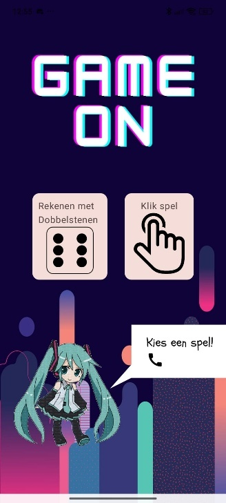
Figuur 3‑8: Homescreen van de app
----
----
Als je een spel hebt gekozen kom je daarna op een pagina om de moeilijkheidsgraad te kiezen.
----
----
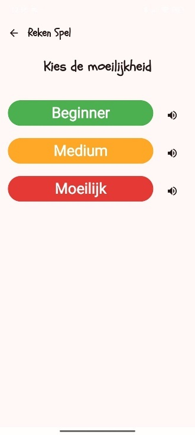
Figuur 3‑9: scherm om moeilijkheidsgraad te kiezen
----
----
Bij het rekenen met dobbelstenen is de makkelijke optie alleen plus. De medium optie plus en min en de moeilijke optie plus, min en maal. Bij het vissen spel worden de vissen steeds kleiner en verspreiden ze zich beter over het scherm.

Aan het einde van de hackathon moesten we ons resultaat presenteren aan de stakeholder die voor haar bachelor proef de verschillende applicaties ging vergelijken. Onze app werd geprezen vanwege hoe makkelijk het in gebruik genomen konden worden en omdat de tekst to speech verstaanbaar en overal geïmplementeerd was. Er waren wel enkele fouten. Zo waren de foute mogelijkheden bij het dobbelstenen spel random getallen tussen nul en 70 wat niet zo handig is als je alleen moet optellen of zelfs min moet doen waarvan het antwoord tussen de 0 en 12 kan liggen. Bij het vissen spel was het probleem dat ze wel moeilijker aan te klikken waren maar dat ze zich niet echt verstopte. Ook waren er regelmatig meer vissen dan het benodigde nummer. Dat transformeerde het spel naar zo snel mogelijk vissen aanklikken en niet het zoeken van vissen.
----

### Hackathon reflectie
----
Voor het begin van de hackathon dacht ik security vulnerabilities te gaan zoeken. Ik was dus heel verbaasd wanneer me verteld werd dat we een applicatie gingen maken. Wat me nog meer verbaasde was hoe sommige teams op 2 dagen ruzie kregen of waarvan de helft gewoon weg was op dag 2. Ik was zeer gelukkig met mijn team en het was een verrassing voor mij hoe snel we iets opgeleverd hadden. Ondanks dat de code best wel hacky was op veel punten.

Van deze hele ervaring heb ik ook geleerd hoe snel hacky code me in de problemen kan brengen. Op dag 2 was het al een probleem. Als de hackathon nog een dag langer was doorgegaan had ik een refactor gedaan. Het heeft me ook laten inzien hoe belangrijk snelle domein specifieke feedback is. Zo was het meeste negatieve feedback op te lossen op vijf of tien minuten maar het maakte wel de spellen veel minder speelbaar. Na de feedback had ik ook pas door hoe groot de inpakt is van het kiezen voor een passende technologie. Onze app was onmiddellijk te gebruiken en kan na een refhg actor verder worden ontwikkeld. Sommige groepjes hadden minder passende technologie gebruikt, namelijk vue.js als een PWA, waardoor hun code net iets meer werk was om te ontwikkelen en ze een aantal stappen moeten doorlopen om het te laten werken zoals gevraagd. Dat heeft ons in vergelijking met de duur van de hackathon veel tijd bespaard. Met de blik naar de toekomst toe ben ik benieuwd of het ook een limiterende factor had kunnen worden.
----
---
---
# Eindreflectie
----
Zoals misschien al duidenlijk is staat mijn I-talent voornamelijk in het teken van mijn ontwikkeling in mijn softskills. Iets wat een groot gat was in mijn professionele skills toen ik begon met studeren aan de PXL. Hoewel ik nu daar nog steeds niet de beste in ben, ben ik er zeker van dat het nu geen struikelblok gaat zijn in mijn verdere carrière. Ik ben dus zeer te vrede in mijn ontwikkeling op dat vlak.

De drie activiteiten die ik in de kijker zet in deze paper zijn mijn uitwisseling, de hackathon en het halen van een hoofdanimator certificaat.

Mijn uitwisseling was een internationaal avontuur in een partner instelling van de PXL waar ik vrienden voor het leven heb gemaakt. Daar heb ik ook in alle vakken maar in het bijzonder tijdens het vak Semester project multidisciplinair samengewerkt met een team dat bestond uit een Ingenieur een bioloog een student projectmanagement en ik als student toegepaste informatica.

Het halen van mijn hoofdanimator certificaat was geen kleine onderneming maar ook dat was een ervaring om nooit te vergeten. Tijdens de cursus en de stage zijn mijn ondernemend vermogen en mijn softskills gegroeid met een snelheid waarvan ik niet verwacht had dat ik het in me had. Het halen van het certificaat deed ik uit passie voor het jeugdwerk en met de intentie een certificaat op mijn CV te zetten dat aan werkgevers duidenlijk maakt dat ik niet allen hardskills maar ook softskills heb.

Tijdens de hackathon heb ik veel bijgeleerd over het snel itereren, het geven van demo’s het belang van stakeholder feedback en hoe leuk het is om op een hele korte tijd veel resultaten te halen. Het laatste is iets wat zich uit in een passie voor het ontwikkelen van kleine tools. Zoals bijvoorbeeld de creatieve verwerking van deze portfolio.

In het kort hebben deze drie activiteiten me geholpen een passie te vinden voor het ontwikkelen van software, Het belang en nut in te zien van multidisciplinaire samenwerkingen, me beter gemaakt in samenwerken zowel Internationaal als nationaal en het heeft me geholpen met ondernemen van evenementen.

Met een blik op de toekomst wil ik vooral ontwikkelingen zien in mijn hardskills. Zo ben ik van plan een low level language te leren en meer te leren over de werking van webprotocollen en de werking van computers in zijn algemeenheid maar ik verwacht niet aan kernel ontwikkeling te gaan doen. Niet dat ik mijn softskills ga laten stagneren, mijn cursus Duits verder zetten lijkt me heel interessant, maar ik denk dat mijn professionele vaardigheden de komende vijf jaar weinig gaan groeien bij een grote tijdsinvestering in mijn softskills. Ik vermoed dat ik al het laaghangende fruit in dat domein geoogst heb.

Omdat te bereiken overweeg ik verder te studeren maar ik kan mezelf ook een baan in het veld gaan zoeken waar dat soort dingen aanbod komen. Na mijn uitwisseling lijkt het voor mij ook geen grote stap meer om internationaal op zoek te gaan naar een baan dat aan die criteria voldoet.
----
---
